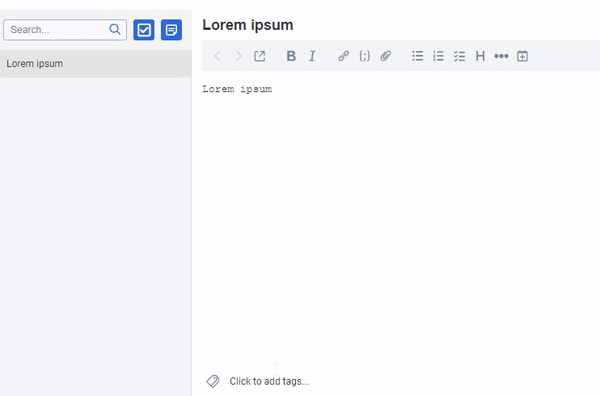

# Joplin Inline Tags Plugin

A plugin for [Joplin](https://joplinapp.org/) that helps to quickly add/create tags while editing a note.

**Requires Joplin 1.7+ and only works in markdown editor**

## Demo

## Usage

Type `#` and select an existing tag to add it to the current note. Keep typing to narrow down the list or to create a new tag and add it to the note immediately.